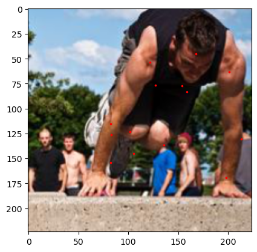

# Human Pose Estimation

This aim of this project is to get human joints to calculate pose of human body. We have used [leeds sports pose dataset (lsp)](https://dbcollection.readthedocs.io/en/latest/datasets/leeds_sports_pose.html) to train CONV regression network. We have used MSE loss function for the network.

# Result

